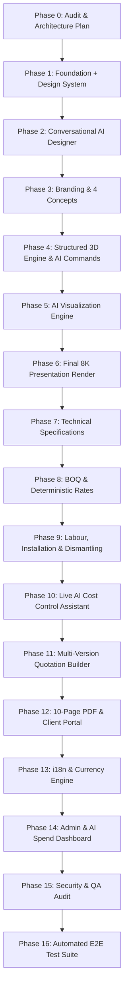

# EXPOCRAFT — ARCHITECTURAL AUDIT & MASTER IMPLEMENTATION PLAN

**Document Version:** 1.0.0  
**Status:** Approved & Baselined  
**System Classification:** Enterprise AI Exhibition Stall Design, Estimation & Turnkey Commercial Engine

---

## 1. Current Architecture Audit

### 1.1 Frontend Framework & Tooling
- **Framework:** Next.js 15.1.7 with App Router (`/src/app`)
- **UI Library & React:** React 19.0.0, React DOM 19.0.0
- **Styling:** Vanilla CSS + Tailwind CSS 3.4.17 with custom dark theme, glassmorphism tokens, and responsive utility architecture.
- **Typography:** Inter & Outfit variable font system loaded via `@next/font/google`.
- **Iconography & Motion:** `lucide-react` (0.475.0), `framer-motion` (12.4.7), `canvas-confetti` (1.9.4).

### 1.2 3D WebGL Visualization
- **Engines:** Three.js 0.173.0, `@react-three/fiber` 9.7.0, `@react-three/drei` 10.7.8.
- **Implementation:** [`ThreeStudioCanvas.tsx`](file:///Users/dilnawaz/antigravity/Expo%20Stall%20Design/src/components/studio/ThreeStudioCanvas.tsx) and [`StudioControls.tsx`](file:///Users/dilnawaz/antigravity/Expo%20Stall%20Design/src/components/studio/StudioControls.tsx).
- **Capabilities:** Interactive orbit controls, modular scene objects (walls, glass, counters, sofas, meeting tables, LED walls, podiums, hanging trusses), parametric dimensions, lighting schemes, and live materials.

### 1.3 Backend & API Architecture
- **Server:** Next.js Route Handlers (`src/app/api/v1/...`).
- **Endpoints Implemented:**
  - `GET /api/v1/ai/config`, `POST /api/v1/ai/config`
  - `POST /api/v1/ai/test-connection`
  - `POST /api/v1/ai/final-render/generate`
  - `GET /api/v1/ai/final-render/jobs/:jobId`, `retry`, `cancel`
  - `GET /api/v1/projects/:projectId/final-renders`
  - `GET /api/v1/final-renders/:renderId`
  - `POST /api/v1/final-renders/:renderId/add-to-quotation`

### 1.4 Database & Persistence
- **ORM / Schema:** Prisma 6.x (`prisma/schema.prisma`) targeting PostgreSQL.
- **Entities Modeled:**
  - `User` (RBAC: `SUPER_ADMIN`, `ADMIN`, `DESIGNER`, `ESTIMATOR`, `SALES`, `CLIENT`)
  - `Client`
  - `Project`
  - `DesignConcept`
  - `FinalRender`
  - `BOQItemRecord`
  - `QuotationRecord`
  - `ActivityLog`
  - `MaterialBenchmark`
- **Client Cache / Fallback:** Persistent `localStorage` sync with default initialization data.

### 1.5 Authentication & RBAC
- **Context:** [`AuthContext.tsx`](file:///Users/dilnawaz/antigravity/Expo%20Stall%20Design/src/context/AuthContext.tsx) managing active session, persona switching, and role-gated UI elements.

### 1.6 Calculation & Pricing Engines
- **Takeoff Engine:** [`takeoffEngine.ts`](file:///Users/dilnawaz/antigravity/Expo%20Stall%20Design/src/lib/takeoffEngine.ts) calculating exact floor area, wall surface, fascia, branding, electrical loads, and 16-category initial BOQ.
- **Market Rate Engine:** [`marketRateEngine.ts`](file:///Users/dilnawaz/antigravity/Expo%20Stall%20Design/src/lib/marketRateEngine.ts) resolving dynamic regional benchmarks across Dubai, Riyadh, Frankfurt, London, Singapore, Chicago, and Las Vegas.
- **Execution Calculators:**
  - Direct Labour ([`LabourCalculator.tsx`](file:///Users/dilnawaz/antigravity/Expo%20Stall%20Design/src/components/execution/LabourCalculator.tsx))
  - Installation Critical Path ([`InstallationCalculator.tsx`](file:///Users/dilnawaz/antigravity/Expo%20Stall%20Design/src/components/execution/InstallationCalculator.tsx))
  - Dismantling & Recovery ([`DismantlingCalculator.tsx`](file:///Users/dilnawaz/antigravity/Expo%20Stall%20Design/src/components/execution/DismantlingCalculator.tsx))

### 1.7 PDF & Document Generation
- **Implementation:** [`MultiPageQuotationPdf.tsx`](file:///Users/dilnawaz/antigravity/Expo%20Stall%20Design/src/components/pdf/MultiPageQuotationPdf.tsx) producing 10-section official client tender proposals.

---

## 2. Gap Analysis & Missing Functionality

| Functional Area | Current Status | Required Enhancement |
| :--- | :--- | :--- |
| **Conversational AI Chat** | Brief wizard & natural prompt field | Interactive conversational chat assistant in AI Designer to parse phrases into structured brief |
| **AI Live Cost Control** | Direct BOQ table edits & rate multipliers | Dedicated conversational budget tuner ("Reduce budget by 15%") with proposal & apply changes |
| **3D AI Natural Commands** | Manual object toolbar + presets | Natural language command interpreter ("Add two chairs beside reception") updating 3D scene |
| **AI Usage Metrics Dashboard** | Basic status badge in Settings | Comprehensive admin usage telemetry (generations count, success/fail rate, spend estimate, latency) |
| **Internationalization (i18n)** | 10 currencies & language selector context | Complete RTL/LTR translation string matrices across 12 languages |

---

## 3. Incremental Implementation Roadmap (Phases 1 to 16)

### Phase Summary Matrix

1. **Phase 1 — Foundation + Design System:** Navigation, role switching, project creation wizard, client directory, clean responsive design system.
2. **Phase 2 — Simple Conversational AI Designer:** Interactive AI chat controller extracting stall dimensions, height, open sides, industry, and functional requirements into structured `DesignBrief`.
3. **Phase 3 — Branding + AI Concept Generation:** Brand guideline analysis, un-distorted vector logo extraction, and 4-concept synthesis (Premium, Creative, Cost-Efficient, Luxury).
4. **Phase 4 — Structured 3D Engine:** Three.js / R3F scene graph with conversational 3D scene editing ("Add two chairs beside reception").
5. **Phase 5 — AI Visualization Engine:** Server-side Google Imagen 3 / Gemini adapter with prompt synthesis.
6. **Phase 6 — Final 8K Presentation Render:** 9-step visualization pipeline, 4 synchronized views (`Hero`, `3/4`, `Interior`, `Detail`), and automated quality check.
7. **Phase 7 — Technical Specification:** Geometric area takeoff, wall perimeters, and electrical KW calculation.
8. **Phase 8 — BOQ + Market Rate Engine:** 16-category deterministic itemized cost builder with global city benchmarks.
9. **Phase 9 — Labour + Installation + Dismantling:** 9-trade labour allocation, 9-phase build timeline, and teardown recovery calculations.
10. **Phase 10 — Live AI Cost Control:** Interactive budget optimizer ("Reduce budget by 15%") with comparison cards and atomic commit.
11. **Phase 11 — Quotation Builder:** Multi-version quotation generator (`V1`, `V2`, `V3`) with margin tuning.
12. **Phase 12 — PDF + Client Portal:** 10-page executive proposal and client interactive sign-off portal.
13. **Phase 13 — Internationalization:** 12 languages (LTR + RTL support) & 10 global currencies.
14. **Phase 14 — Admin + AI Usage Dashboard:** Provider telemetry, spend estimation, error logging, and rate management.
15. **Phase 15 — QA + Security Audit:** Sanitization, key masking, permission boundaries, and responsive checks.
16. **Phase 16 — End-to-End Verification:** Automated pipeline run validating the entire workflow.

---

## 4. Testing & Verification Strategy

- **Unit & Arithmetic Checks:** Deterministic verification of BOQ arithmetic, markups, taxes, and margin formulas.
- **Integration API Testing:** Next.js Route Handler verification for AI config, connection diagnostic, job generation, and quotation attachment.
- **Visual Regression & 3D WebGL:** Rendering validation for Three.js canvas across standard viewport dimensions.
- **Security Scans:** Strict verification of zero client-side key leakage, masked UI inputs, and `.env.example` sanitization.
